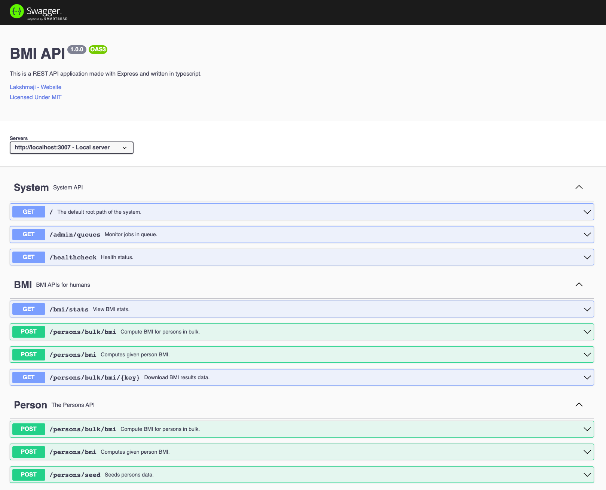

# BMI 

[](https://github.com/lakshmaji/code-2022-lakshmaji/actions/workflows/lint_build.yml)

A sample express js API, to illustrate handling of JSON files at scale (in GB's).



## Installation

1. Install project dependencies

    ```bash
    yarn install
    ```

2. Install redis

    1. You can follow the instructions [here](https://redis.io/docs/getting-started/installation/), or you can pull `redis` image to use with docker.

    ```bash
    docker run --name local-cache -p 6379:6379 redis
    ```

## Documentation

Swagger (OpenAPI spec): [Local version](http://localhost:3007/docs/)

## Development

```bash
yarn dev
```

OR

```bash
docker-compose up -d
```

## Monitor background tasks

Click [here](http://localhost:3007/admin/queues) or Open `http://localhost:3007/admin/queues` in browser

## TODO

- [ ] supertest (e2e only).
- [ ] input Validations
- [ ] Add cloud storage (space limitation with disk storage)
- [ ] Add auto deploy pipeline (after cloud storage integration is completed).
- [ ] Could use observables to communicate between features (in isolation)